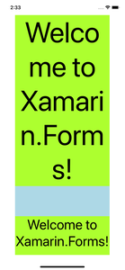

# Xamarin Label Font Sizer

- [Overview](#overview)
- [Setup and Use](#setup-and-use)
  - [Function Parameters](#function-parameters)
    - [CalculateMaxFontSize()](#calculatemaxfontsize)
  - ['Word Safe' Details](#word-safe-details)
- [Ghost Sizing :tm:](#ghost-sizing-tm)
- [Font Sizer Limitations / Things to Watch Out For](#font-sizer-limitations--things-to-watch-out-for)
  - [Broken Property Bindings (use ghost sizing)](#broken-property-bindings-use-ghost-sizing)
  - [Word Safe - Space Delimited Words (Localization Issue)](#word-safe---space-delimited-words-localization-issue)
  - [Sizing Limited to Label Objects](#sizing-limited-to-label-objects)
  - [Be Careful With Flexible Container Measurements](#be-careful-with-flexible-container-measurements)

## Overview

The Label Font Sizer is a tool for calculating and setting the size of a label's font so that the label will grow (or shrink) to fill the space available to it. This project is based on the Empirical Font Sizing sample project, which has been modified to increase flexibility and add functionality.

While the Font Sizer handles key use cases, it can still be improved in many ways. I welcome your fixes, enhancements, and additions.

**Sample Project -** There is a sample project included in this repo in the `FontSizer_Sample` directory. Open the included solution file and run the program.

## Setup and Use

1. Import the Font Sizer project into your solution.


2. Add references to the Font Sizer in projects that will use it (main shared project is required).


3. Include the Font sizer namespace in the classes where you want to use it -  `using XamarinLabelFontSizer;`

4. Call the static sizing function with your sizing parameters. It returns a `double` value. **Recommended:** Use the [Ghost Sizing](#ghost-sizing-tm) method described below.

5. Set the font size of a label to the returned value.

```csharp
double labelFontSize = FontSizer.CalculateMaxFontSize(myLabel, 10, 200, stackLayout.Width, stackLayout.Height / 3);

myLabel.FontSize = labelFontSize;
```

### Function Parameters

#### CalculateMaxFontSize()

```csharp
public static double CalculateMaxFontSize(Label label, int minFontSize, int maxFontSize, double containerWidth, double containerHeight, bool wordSafe = true, bool sizeForWidth = false)
```

- `Label` **label** - The label object to be sized to fit its containing space. The function modifies the label's text data for calculations, so it is recommended to use the [Ghost Sizing](#ghost-sizing-tm) method described below to avoid breaking any bindings.
  
- `double` **minFontSize** / maxFontSize - Constraints for the output font size. The results will never be smaller or larger than these constraints.
  
- `double` **containerWidth** / containerHeight - The width and height of the space the label should fit. Instead of calculating based on the containing object, these have been made double values to allow for fractional space constraints like `myContainer / 2` or simply `240`.
  
- `bool` **wordSafe** - Enables the 'word safe' width calculations to prevent word splitting across multiple lines. The default is `true`. It is not intended to be set by the calling function at this time.
  
- `bool` **sizeForWidth** - Used to set calculation values during a 'word safe' The default is `false`, and it is enabled during the function call when needed. It is not intended to be set by the calling function at this time.

### 'Word Safe' Details

The main feature I added to the base project is the 'word safe' functionality. Originally, the sizing was only performed using container height in the conditions checking if the label fit. It kept the label from extending beyond the bottom of the container, but there was a possibility that if the text was sized large enough, longer words could be split over multiple lines of the label, resulting in obvious visual bugs.

**Top:** original || **Bottom:** Word Safe enabled
(same space constraints)



To solve this problem, I modified the `CalculateMaxFontSize()` function to also perform a width check using the longest word of the label as the sizing object. (This is the main reason the label text is modified within the function.) To use word safe, don't the `bool wordSafe` or the `bool sizeForWidth` when calling the function.

When enabled, the `CalculateMaxFontSize()` calls itself recursively to first calculate the max size for a width fit of the longest word and second to calculate the max size for a height fit using the results of the width fit as the maximum possible font size for the height fit.

I suppose word safe can be disabled by setting the `wordSafe` parameter to `false` when you call the function.

This recursion with conditions seem like the most elegant solution, but I haven't thought of a better method just yet. It works well enough.

## Ghost Sizing :tm:

It turns out that setting the `Text` property of a Label to calculate 'word safe' sizes can cause a nasty problem - **breaking property bindings.** (I blame this partially on [C# reference types and object parameter passing](https://docs.microsoft.com/en-us/dotnet/csharp/programming-guide/classes-and-structs/passing-parameters).)

I know this happens because I built the Font Sizer to help me size some text in a localization-ready project where **all** of the labels had dynamic bindings on their `Text` property so that localized resources could be loaded into them on a language change. After sizing the labels, the text values remained the same forever because the binding had been overridden by setting the property explicitly. Sure, this could be solved by re-setting the bindings after sizing, but that's a costly operation that is best avoided.

Instead, you can use the workaround I call 'Ghost Sizing'. It's simple and safe, and it works like this.

1. Add an invisible Label (a ghost label!) somewhere in the app page where the font sizing occurs. Add any property settings you want.
2. Set the ghost label's text to the same as the label you want to size.
3. Use the ghost label in the sizing function.

**XAML:**

```xml
<!--  for sizing other elements without breaking bindings  -->
<Label x:Name="ghostLabel" IsVisible="false" />
```

**C# code-behind:**

```csharp
ghostLabel.Text = String.Copy(myLabel.Text);

double labelFontSize = FontSizer.CalculateMaxFontSize(ghostLabel, 10, 200, stackLayout.Width, stackLayout.Height / 3);

myLabel.FontSize = labelFontSize;
```


This method ensures the label you want to size is never modified, and it works just the same. :wink:

## Font Sizer Limitations / Things to Watch Out For

### Broken Property Bindings (use ghost sizing)

Because of the way C# objects reference data, any label property modified during the sizing has its binding overridden and replaced with explicit data. (Only the `Text` property at this time.) The ghost sizing method explained in this document gets around this nicely. Ghost sizing is not required, but you should be aware of the risks when not using it.

### Word Safe - Space Delimited Words (Localization Issue)

The word safe feature relies on finding the longest word in a label's text property by splitting the string and getting the longest substring (i.e. the longest word). Right now, the string is split wherever a 'space' character is found.

This follows the critical assumption that the provided text language uses the space character as a word (or morphemes) delimiter. However, not all alphabets use spaces to differentiate between words, so relying on this delimiter is a clear linguistic limitation of the tool.

In the main 'FontSizer' class there is a Dictionary named `localeWordDelimiters` where I would like to add culture-specific word delimiters over time as they are shown to work within the use case of the tool. This may be a bit naive linguistically, but it will cover some situations. For languages that may not have obvious character delimiters, another solution will need to be found for 'word safe' sizing (or its language-specific equivalent).

### Sizing Limited to Label Objects

Since the Font Sizer only accepts Label objects into the sizing function, this tool only works consistently for labels. However, there are some workarounds. For example, a Picker can be sized through a few extra steps. Take the longest string value from the picker, copy it to a ghost label, and size the ghost label with a width constraint that accounts for the picker display padding.

```xml
<!--  for sizing other elements without breaking bindings  -->
<Label x:Name="ghostLabel" IsVisible="false" />
```

```csharp
// using Linq
string longestWord = myPicker.Items.Aggregate("", (max, cur) => max.Length > cur.Length ? max : cur);

ghostLabel.Text = String.Copy(longestWord);

// size to 90% of available width, padding for the picker text
pickerFontSize = FontSizer.CalculateMaxFontSize(ghostLabel, 10, 200, stackLayout.Width * 0.9, stackLayout.Height / 2);

myPicker.FontSize = pickerFontSize
```

Using methods like this, it may be possible to auto-fit a number of different elements indirectly. You might as well try.

### Be Careful With Flexible Container Measurements

The container view you work with must understand its height limitations. Be careful with flexible layouts that size themselves based on their contents, because they may not always be aware of their size.

For example, a label inside a stack layout inside a grid works fine because the stack layout can expand to the grid size just fine

*However*, a label inside a stack layout lets the label overflow beyond the expected height. The middle stack thinks it can extend forever since the outer stack doesn't have size knowledge from the middle stack. It's a sizing mess, and you'll most likely notice when this is happening.

(I feel I've done a poor job explaining this, so please read the [StackLayout docs](https://docs.microsoft.com/en-us/xamarin/xamarin-forms/user-interface/layouts/stacklayout#position-and-size-of-child-views) for more info.)

---

Again, I'm totally open to improvements that help deal with these limitations. Please get in touch if you have some ideas. :slightly_smiling_face:
